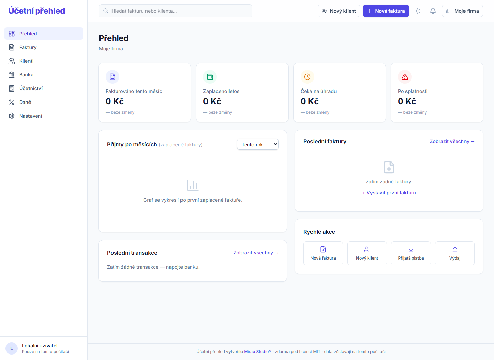

# Účetní přehled

Bezplatný lokální český program pro fakturaci, klienty, bankovní pohyby, účetní exporty a daňové podklady. Běží přímo v počítači uživatele — bez registrace, přihlášení, cloudového účtu a úvodního webu.

Vytvořilo [Mirax Studio®](https://www.miraxstudio.cz). Program je poskytován zdarma pod [licencí MIT](LICENSE).



## Aktuální vydání — 1.0.1

Bezpečnostní vydání. Doporučujeme aktualizovat; data ani nastavení zůstávají,
stačí nový ZIP rozbalit a složky `data` a `storage/app` z předchozí verze do
něj přenést.

- program nyní odpovídá jen na adresy `127.0.0.1` a `localhost`. Cizí doména
  přesměrovaná na tento počítač dřív dostala stránky programu jako svůj
  vlastní obsah a mohla si z nich přečíst ochranný token formulářů;
- cookies programu mají přísnější nastavení (`SameSite=Strict`, revizní
  cookie nově nepřístupná JavaScriptu);
- statické soubory dostávají bezpečnostní hlavičky i mimo aplikaci a server
  nevydává konfigurační soubory začínající tečkou;
- odpovědi přibraly hlavičky `Cross-Origin-Opener-Policy`
  a `Cross-Origin-Resource-Policy`;
- v zásadách soukromí je nově výčet cookies, které program ukládá.

### Vydání 1.0.0

První veřejné vydání pod názvem **Účetní přehled**.

- funguje výhradně lokálně na Windows x64;
- obsahuje vlastní PHP runtime, takže nevyžaduje XAMPP, PHP, Composer, Node.js ani databázový server;
- neobsahuje výchozí faktury, klienty, bankovní účty, transakce ani uživatelské nastavení;
- `START.bat` spustí aplikaci a otevře ji v prohlížeči;
- `STOP.bat` ukončí pouze přibalený lokální server programu;
- živé náhledy faktur, vzhledy PDF a účetní exporty jsou ověřené v lokálním režimu.

## Stažení a spuštění

Hotový program stahujte pouze ze [sekce Releases](https://github.com/miraxstudio-del/ucetni-prehled/releases/latest). Tlačítko **Code → Download ZIP** na GitHubu obsahuje zdrojový kód pro vývojáře, nikoli hotový program k běžnému spuštění.

1. Stáhněte `Ucetni-prehled-Windows-x64-v1.0.1.zip` z [vydání 1.0.1](https://github.com/miraxstudio-del/ucetni-prehled/releases/tag/v1.0.1).
2. Stáhněte také soubor `Ucetni-prehled-Windows-x64-v1.0.1.zip.sha256` a volitelně ověřte kontrolní součet.
3. ZIP kompletně rozbalte do libovolné složky.
4. Dvakrát klikněte na `START.bat`.
5. Program se otevře v místním prohlížeči. Pro ukončení spusťte `STOP.bat`.

Při prvním spuštění se automaticky vytvoří prázdná lokální databáze `data/ucetni-prehled.sqlite`, šifrovací klíče a výchozí organizace „Moje firma“. Program si zvolí volný port v rozsahu `8090–8099` a naslouchá pouze na `127.0.0.1` — není dostupný z internetu ani z dalších zařízení v síti.

> Pokud Windows při spuštění oznámí chybějící `VCRUNTIME140.dll` nebo podobnou knihovnu, nainstalujte [Microsoft Visual C++ Redistributable pro Visual Studio 2015–2022 (x64)](https://aka.ms/vs/17/release/vc_redist.x64.exe) a aplikaci spusťte znovu.

## Kontrola staženého souboru

Soubor `.sha256` ověřuje, že instalační ZIP byl stažen celý a nebyl změněn. V PowerShellu spusťte ve složce se staženým ZIPem:

```powershell
Get-FileHash .\Ucetni-prehled-Windows-x64-v1.0.1.zip -Algorithm SHA256
```

Zobrazený otisk musí přesně odpovídat hodnotě v souboru `Ucetni-prehled-Windows-x64-v1.0.1.zip.sha256` přiloženém k témuž Release.

## Funkce

| Oblast | Funkce |
| --- | --- |
| Fakturace | Vydané i přijaté faktury, koncepty, vystavení, úhrady, storna, duplikace, PDF a ISDOC. |
| Klienti | Evidence odběratelů a dodavatelů, volitelné vyhledání firmy podle IČO v ARES. |
| Banka | Ruční import a export transakcí, párování úhrad s fakturami a volitelné napojení Fio banky. |
| Účetnictví | CSV, XLSX, Pohoda XML, Money S3 XML, ZIP pro účetní a import klientů, faktur či ISDOC. |
| Daně | Lokální přehled a nastavení podkladů pro daňové období. |
| Nastavení | Údaje firmy, číselné řady, bankovní účty, logo, vzhled a podklady faktur. |

## Soukromí a síťová komunikace

Účetní přehled neobsahuje telemetrii, analytiku, reklamní měření, cloudový účet ani automatické odesílání dat Mirax Studio nebo jiné třetí straně. Faktury, klienti, nastavení, bankovní pohyby a soubory zůstávají v počítači uživatele.

V kódu jsou pouze dvě volitelné síťové integrace, které se použijí výhradně po vědomé akci uživatele:

- **ARES:** ruční vyhledání firmy podle IČO odešle pouze zadané IČO do veřejného rozhraní ARES.
- **Fio banka:** ručně spuštěná synchronizace používá uživatelem nastavené API Fio.

Podrobnosti jsou v [PRIVACY.md](PRIVACY.md).

## Data a zálohy

Po ukončení programu přes `STOP.bat` zálohujte zejména:

| Co | Umístění |
| --- | --- |
| Databáze faktur, klientů a nastavení | `data/ucetni-prehled.sqlite` |
| Nahrané obrázky a soubory | `storage/app` |

Za pravidelné zálohy, zabezpečení počítače a správnost zadávaných údajů odpovídá uživatel.

## Zdrojový kód a vývoj

Hlavní větev obsahuje zdrojový kód a dokumentaci bez přibalených provozních binárek. Pro vývoj je potřeba PHP 8.2+, Composer a Node.js:

```powershell
composer install
npm install
npm run build
php artisan test
```

Windows instalační balíčky a kontrolní součty patří výhradně do [GitHub Releases](https://github.com/miraxstudio-del/ucetni-prehled/releases).

## Licence, autor a odpovědnost

Účetní přehled je zdarma pod [licencí MIT](LICENSE). Není účetním, daňovým ani právním poradenstvím. Software je poskytován bez záruky; za účetní a daňové postupy, kontroly výstupů, zálohy a splnění povinností odpovídá uživatel.

Název „Účetní přehled“ je popisné označení programu, nikoli tvrzená ochranná známka. Označení **Mirax Studio®** identifikuje autora a jeho použití upravuje [TRADEMARKS.md](TRADEMARKS.md).

- [Právní upozornění](NOTICE.md)
- [Soukromí a lokální data](PRIVACY.md)
- [Použití označení Mirax Studio®](TRADEMARKS.md)

© 2026 [Mirax Studio®](https://www.miraxstudio.cz)
